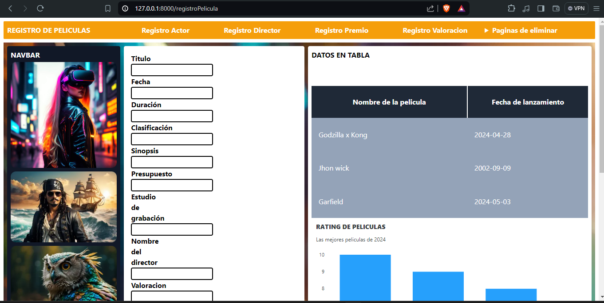

# Proyecto CRUD de Películas

Este proyecto es una aplicación web de gestión de películas, desarrollada con Laravel, Tailwind CSS y Livewire. La base de datos utilizada es PostgreSQL. La aplicación permite realizar operaciones CRUD (Crear, Leer, Actualizar y Eliminar) en un catálogo de películas.



## Requisitos

Antes de comenzar, asegúrate de tener instaladas las siguientes herramientas en tu sistema:

- PHP >= 7.4
- Composer
- Node.js
- PostgreSQL

## Instalación

Sigue estos pasos para instalar y configurar el proyecto en tu máquina local.

### 1. Clonar el repositorio

```bash
git clone https://github.com/Chris3riel/LaravelMovieAPP-CRUD.git
cd LaravelMovieAPP-CRUD
```

### 2. Instalar dependencias de PHP

```bash
composer install
```

### 3. Instalar dependencias de JavaScript

```bash
npm install
npm run dev
```

### 4. Configurar el archivo `.env`

Copia el archivo `.env.example` y renómbralo a `.env`. Luego, configura las variables de entorno, especialmente las relacionadas con la base de datos.

```plaintext
DB_CONNECTION=pgsql
DB_HOST=127.0.0.1
DB_PORT=5432
DB_DATABASE=nombre_de_tu_base_de_datos
DB_USERNAME=tu_usuario
DB_PASSWORD=tu_contraseña
```

### 5. Generar la clave de la aplicación

```bash
php artisan key:generate
```

### 6. Ejecutar las migraciones y sembrar la base de datos

```bash
php artisan migrate --seed
```

## Uso

Para iniciar el servidor de desarrollo, ejecuta el siguiente comando:

```bash
php artisan serve
```

La aplicación estará disponible en `http://localhost:8000`.

## Estructura del Proyecto

- `app/Http/Livewire`: Componentes Livewire.
- `resources/views`: Vistas Blade con integración de Tailwind CSS.
- `database/migrations`: Migraciones de la base de datos.
- `routes/web.php`: Rutas web de la aplicación.

## Funcionalidades

- **Listar Películas**: Visualiza una lista de todas las películas en el catálogo.
- **Agregar Película**: Agrega una nueva película al catálogo.
- **Editar Película**: Modifica la información de una película existente.
- **Eliminar Película**: Elimina una película del catálogo.

## Tecnologías Utilizadas

- **Laravel**: Framework PHP para el backend.
- **Tailwind CSS**: Framework de CSS para el diseño y estilo.
- **Livewire**: Framework de Laravel para componentes dinámicos.
- **PostgreSQL**: Sistema de gestión de bases de datos relacional.

## Contribuciones

Las contribuciones son bienvenidas. Si deseas contribuir a este proyecto, por favor sigue estos pasos:

1. Haz un fork del proyecto.
2. Crea una nueva rama (`git checkout -b feature/nueva-funcionalidad`).
3. Realiza tus cambios y haz commit (`git commit -am 'Agrega nueva funcionalidad'`).
4. Haz push a la rama (`git push origin feature/nueva-funcionalidad`).
5. Abre un Pull Request.

## Licencia

Este proyecto está bajo la Licencia MIT. Para más detalles, revisa el archivo [LICENSE](LICENSE).

